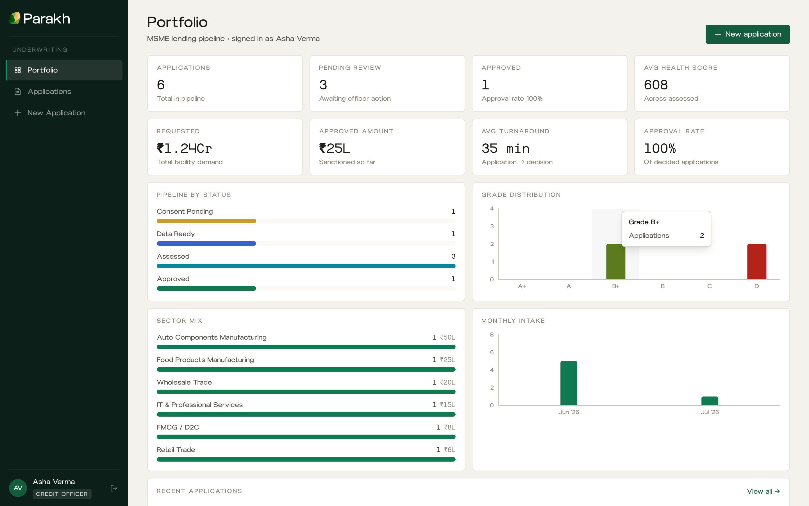

<div align="center">

<picture>
  <source media="(prefers-color-scheme: dark)" srcset="frontend/public/logo-dark.svg">
  
</picture>

### परख · to assay, to test

**Credit intelligence for the MSMEs banks can't see.**

Parakh triangulates a business's GST filings, bank statements and EPFO payroll
into an explainable 300-900 health score, a 12-month stress outlook and an
audit-ready credit memo, about a minute after consent.

[](backend)
[](backend)
[](frontend)
[](frontend)
[](frontend)
[](backend/tests)
[](LICENSE)

*Built for IDBI Innovate 2026, Track 3: MSME Financial Health Score.*



</div>

---

## The gap

Most MSMEs aren't unviable. They're invisible. No audited financials, no bureau
file, no score. So the lending system defaults to collateral and paperwork, and
working businesses get a no.

But the proof of their health already exists, written every month onto three
rails the business can consent to share:

| Rail | What it proves |
|---|---|
| **GST network** | Declared revenue: GSTR-1/3B filings show turnover, filing discipline, growth |
| **Bank rails** | Cash reality: Account Aggregator statements show what actually lands |
| **EPFO payroll** | Real operations: provident-fund contributions show the payroll a real business must carry |

Parakh reads all three, and makes them agree with each other.

## How it works

```
consent  →  triangulate  →  score & stress  →  decide
```

1. **Consent.** DEPA-style artefacts per rail: purpose-bound, time-bound,
   revocable. Every data pull is SHA-256 hashed for integrity.
2. **Triangulate.** Six cross-source fraud checks gate the pipeline. Inflated
   GST turnover, circular fund flows and window dressing die here, before any
   score exists. The result is a Verification Index (0-100) that caps
   everything downstream.
3. **Score & stress.** Five explainable pillars fold into a 300-900 health
   score with reason codes, then a 12-month liquidity-buffer projection names
   the risks ahead (first projected breach, PD, early-warning signals).
4. **Decide.** A DSCR-constrained limit the cash flows can service today, a
   credit memo citing every figure to its consented pull, and a borrower-facing
   Health Card: a pre-qualified offer when it clears, an improvement roadmap
   with a re-review date when it doesn't.

## What ships

- **Marketing page** at `/welcome` and a full **underwriting console**: portfolio
  dashboard, application lifecycle, assessment workspace, verification, cash
  flow, stress outlook, credit memo, consent & data tabs
- **Deterministic engines** (pure functions, no I/O inside): triangulation,
  5-pillar scoring, buffer-depletion stress, affordability right-sizing, memo
  drafting. Reproducible numbers a model-risk committee can approve
- **Borrower Health Card**: plain-language, printable, with roadmap and impact
  points (`/applications/:id/card`)
- **Ecosystem surface**: `GET /api/v1/ecosystem/health-report/{id}` emits a
  portable, consent-annotated score document (`parakh.health-report.v1`) for
  ULI/OCEN-style consumption
- **Bank-grade rails**: JWT + RBAC, sliding-window rate limits, PII masking,
  append-only audit trail, security headers
- **Swap-in connectors**: demo runs on deterministic synthetic rails; an
  experimental, config-gated Setu AA sandbox connector ships in
  `backend/app/connectors.py` (set the `PARAKH_SETU_*` env vars)

## Quickstart

```bash
./run.sh --fresh    # clears ports, seeds six demo MSMEs, starts both servers
```

Then open http://localhost:5173 (API docs at http://localhost:8000/docs).

Or manually, with Python 3.13 and Node 22:

```bash
# backend, API on :8000 (auto-seeds SQLite on first start)
cd backend
python3.13 -m venv .venv && .venv/bin/pip install -r requirements.txt
.venv/bin/uvicorn app.main:app --port 8000

# frontend, console on :5173 (proxies /api to :8000)
cd frontend
npm install && npm run dev
```

Or Docker:

```bash
docker compose up --build     # console on http://localhost:8080
```

### Demo accounts

| Role | Email | Password | Can |
|---|---|---|---|
| Credit Officer | `officer@parakh.demo` | `Officer@2026` | originate, assess, decide up to 25L |
| Risk Head | `risk@parakh.demo` | `Risk@2026` | decide any amount, alerts, audit log |
| Admin | `admin@parakh.demo` | `Admin@2026` | administration, audit log |

## Six personas in, six right calls

The seed stages six synthetic MSMEs with known ground truth. The engine lands
on the right side of every one:

| Applicant | Ground truth | Engine outcome |
|---|---|---|
| **Saraswati Kirana** | Honest cash-economy retailer, banked inflows exceed GST filings | 704 · B+ · approve |
| **Rathore Textiles** | Fraudster: GST inflated 2.9x, circular flows, round month-end credits | VI 19, capped at 480 · D · decline |
| **Meher Foods** | Strongly seasonal manufacturer | 723 · B+ · deseasonalised correctly |
| **Nexus Digital** | Healthy new-to-credit IT firm (run the assessment live) | 782 · A · approve |
| **Balaji Auto** | Real business deteriorating: bounces, GST delays | PD-12m 99%, 4 EWS signals · decline |
| **GreenLeaf Organics** | 14-month-old thin file asking 8L | right-sized to 3L · conditional |

The point of Rathore: its pillar scores alone look decent. Only the
triangulation catches it. The point of GreenLeaf: a rejection becomes a
pipeline instead of a dead end.

## Deploy (Render, free)

The repo ships a [`render.yaml`](render.yaml) blueprint: one free web service
runs the API and serves the built frontend from the same origin.

1. Render dashboard, New, Blueprint, pick this repo, deploy.
2. Done. The instance auto-seeds the demo data on boot (the data is
   deterministic, so restarts reproduce identical numbers).

Live demo: **https://parakh-idbi.onrender.com**

The free tier sleeps after about 15 minutes idle;
[`.github/workflows/keep-warm.yml`](.github/workflows/keep-warm.yml) pings
`/healthz` every 10 minutes to keep it awake. If Render assigns a subdomain
other than `parakh-idbi.onrender.com`, update `PING_URL` in that workflow.

## Testing

```bash
cd backend && .venv/bin/python -m pytest    # 38 unit + integration tests
```

A full-stack Playwright smoke (`e2e/smoke.py`, 14 steps) drives a real browser
against both live servers. Everything is deterministic: the demo anchor date is
fixed in config, so judges see exactly these numbers.

## Repository layout

```
backend/app/
  engines/          triangulation · scoring · stress · memo · healthcard (pure functions)
  connectors.py     AA / GST / EPFO behind a production-swap interface
  synth.py          seeded synthetic personas (deterministic)
  services.py       lifecycle state machine (create → consent → assess → decide)
  routes/           REST API (OpenAPI at /api/v1/openapi.json)
  models.py         SQLAlchemy ORM (SQLite dev, Postgres prod)
frontend/src/
  pages/Landing.tsx marketing page (hand-built product miniatures, no screenshots)
  pages/…           login + console (React 18, TypeScript strict, Tailwind v4)
docs/               API-CONTRACT.md · ARCHITECTURE.md · SECURITY.md
e2e/                Playwright smoke + screenshot capture
```

See **docs/ARCHITECTURE.md** for the scaling story and the production data-rail
swap, and **docs/SECURITY.md** for the control model.

## License

Apache 2.0. See [LICENSE](LICENSE).

> Demo environment, synthetic data only. No real credit decisions.
